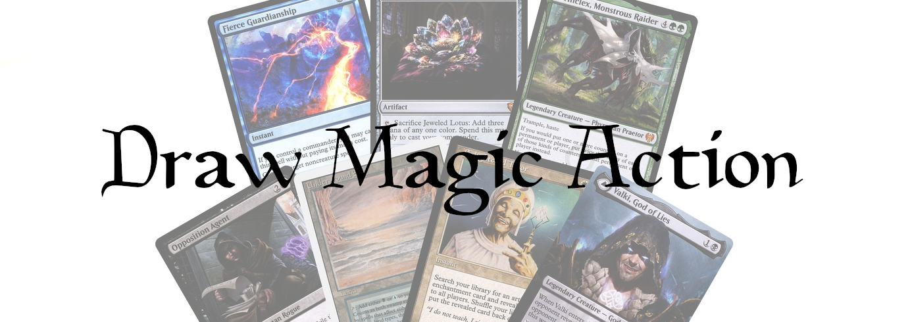
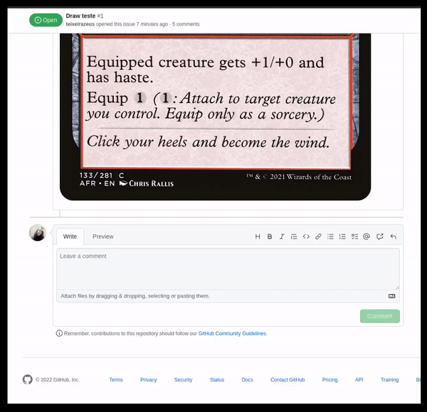

Draw Magic Card on GitHub issue.



It takes about 10 seconds to draw.

## Inputs

### `github-token`

**Required** The GitHub token used to create an authenticated client.

## Example usage

```yaml
name: Draw Magic Card
on:
  issue_comment:
    types: [created, edited]

jobs:
  draw:
    runs-on: ubuntu-latest
    steps:
      - name: Draw Magic Card on GitHub issue
        uses: teixeirazeus/draw-magic-action@main
        if: >-
          contains(github.event.comment.body, 'draw')
          || contains(github.event.comment.body, 'ドロー')
        with:
          github-token: ${{secrets.GITHUB_TOKEN}}
```

## Demo

Please comment "draw" to [this issue](https://github.com/teixeirazeus/draw-magic-action/issues/1)!
